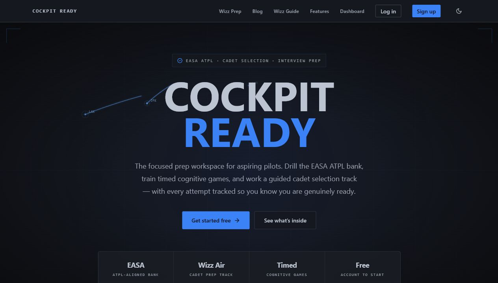
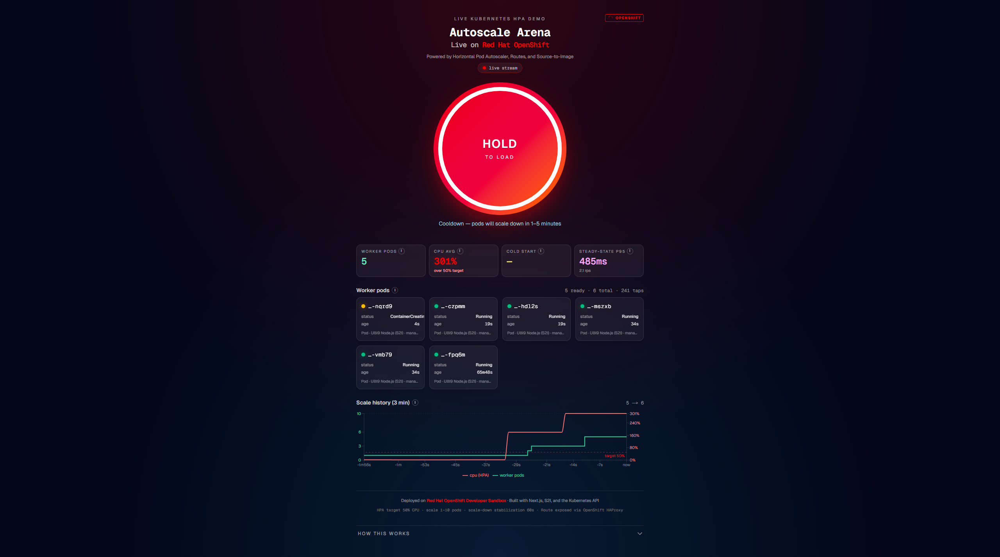
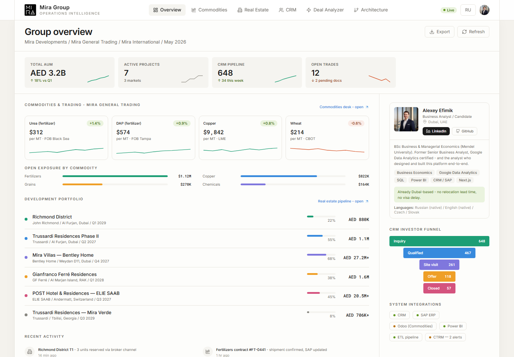

# Alex Efimik

## Web3

*A full, "proper" Web3 product is still in progress. These are the public, interactive explainer builds leading up to it — accurate and hands-on, not hyped.*

### [Chain, Explained](https://github.com/Alexey3250/chain-explained) — a slide-by-slide walkthrough of how Bitcoin actually works, for visual learners

Start from a single hash and zoom out to a global network no one owns. Every SHA-256 hash, secp256k1 keypair and signature, and mined block is computed **for real, in the browser** — and several slides read live data straight from the Bitcoin network. Five acts, fifteen slides; keyboard- and swipe-navigable, deep-linkable via URL hash. Nothing is faked.

**Stack:** Next.js 16 · React 19 · TypeScript · Tailwind v4
**Live:** [chain-explained.vercel.app](https://chain-explained.vercel.app)

#### Also in the workshop

- **[the machines](https://github.com/Alexey3250/chain-machines)** — living pixel diagrams of blockchain networks, one honest little simulation per chain (blocks packed, validators vote, fees burn). Ethereum proof-of-stake is a live sim (staking → PBS builder → blobs → attest → seal + burn); Bitcoin, Solana, and Lightning are still in the shop. [Live](https://chain-machines.vercel.app).
- **[kilobit](https://github.com/Alexey3250/kilobit)** — a tiny, dependency-free TypeScript toolkit for crisp pixel-art animation on a 2D canvas (supersampled surface, throttled rAF loop, pointer hit-testing, deterministic RNG). It's the engine that renders "the machines" pixel by pixel.

---

## Selected projects

### [Cockpit Ready](https://cockpitready.com) — cadet aptitude, Wizz Air interview, and EASA ATPL prep workspace
Pilot-selection learning platform for aspiring pilots, combining an EASA ATPL question bank, Wizz Air cadet preparation track, timed cognitive games, interview/test preparation, progress tracking, and readiness-focused study flows. Built from my own pilot-training work and now live on a dedicated domain.

**Stack:** Next.js · TypeScript · Tailwind · MongoDB · Clerk · custom domain
**Live:** [cockpitready.com](https://cockpitready.com)

### [Autoscale Arena](https://github.com/Alexey3250/autoscale-arena) — This short demo shows OpenShift autoscaling a worker deployment under generated load. As load increases, worker CPU rises, the Horizontal Pod Autoscaler adds replicas, and the UI tracks pod state and scale history live.

[Watch the 35-second demo video](autoscale-arena-demo.mp4)

**What to watch:**

- Load increases through the UI
- Worker CPU rises
- HPA scales worker pods up
- Pod state updates live from the Kubernetes API
- Scale history changes as the cluster reacts

**Stack:** Next.js · TypeScript · Tailwind · OpenShift
**Live:** [Link](https://autoscale-arena-frontend-alexeyefimik-dev.apps.rm1.0a51.p1.openshiftapps.com/)

### [trustworthy-rag-demo](https://github.com/Alexey3250/trustworthy-rag-demo) — *small models with good scaffolding beat brute force*

Demonstration that for domain-bounded chat (government services, FAQs, customer support) you do not need a 70B+ model — a small open-weight model with the right scaffolding handles it as well or better. The scaffolding here is a three-tier confidence router (gold / amber / gray) that returns grounded answers when retrieval is confident, asks for clarification when ambiguous, and refuses without calling the LLM when out of scope. Jurisdiction-portable; demonstrated on the Service NSW open-data corpus, the same pattern wraps any government open-data source.

**Stack:** Next.js · TypeScript · Tailwind · Python · Cerebras API · Ollama local models
**Live:** [trustworthy-rag-demo.vercel.app](https://trustworthy-rag-demo.vercel.app)

### [MIRA Group Operations Intelligence Platform](https://github.com/Alexey3250/mira-group-business-analyst-portfolio) - Business Analyst portfolio for a Dubai operations role

Working Next.js prototype for a MIRA Group LLC Business Analyst application. It connects a real estate-first group overview with a dedicated commodities desk for fertilizers, agricultural bulk products, and industrial materials, plus CRM funnel reporting, live market-risk signals, and a CRM-to-SAP deal margin analyzer.

**What to watch:**

- Real estate portfolio KPIs, project progress, CRM funnel, and system status in one executive view
- Commodities desk with live FX and market-risk signals from public APIs
- Deal Margin Analyzer that enriches a mock CRM trade and produces a simulated SAP ERP payload
- Static Chromium-rendered PDF export for stakeholder sharing

**Stack:** Next.js · TypeScript · Tailwind · Vercel · Public APIs  
**Live:** [mira-group-business-analyst-portfol.vercel.app](https://mira-group-business-analyst-portfol.vercel.app)  
**PDF:** [portfolio report](https://mira-group-business-analyst-portfol.vercel.app/mira-group-business-analyst-portfolio.pdf)

---

## Stack

**Languages & frameworks** Python · TypeScript · JavaScript · Next.js · React · Tailwind
**Platforms & deployment** OpenShift · Microsoft Azure · Vercel · Netlify · Cerebras Cloud
**Backend & data** FastAPI · MongoDB · Clerk
**ML & data science** PyTorch · scikit-learn · pandas · NumPy · CatBoost

---

## Education

**Bachelor's, Business / Managerial Economics** — Mendel University in Brno, Czech Republic (2012–2015)

---

## Certifications

<table>
<tr>
<td align="center">
<h4>Microsoft Azure Fundamentals</h4>

 
<a href="https://www.credly.com/badges/a4c3274d-286a-4612-86cd-2024f9615766/public_url">View Credential</a>
</td>
<td align="center">
<h4>Harvard CS50 + CS50 AI</h4>

 
<a href="https://certificates.cs50.io/ee8f7ceb-2ba4-4ec6-8275-8a57f92bcbef.pdf?size=letter">View Credential</a>
</td>
<td align="center">
<h4>Google Data Analyst</h4>

 
<a href="https://www.credly.com/badges/b1b99106-841e-4d6a-a35a-4b43666188cf/public_url">View Credential</a>
</td>
<td align="center">
<h4>IBM Data Science Methodology</h4>

 
<a href="https://www.credly.com/badges/f971140c-4747-47f7-a7b5-99d8ecbf6d7f/public_url">View Credential</a>
</td>
</tr>
</table>

---

## Languages

English (working) · Russian (native) · Czech (working)

---

## Contact

📧 a.efimik@gmail.com
🔗 [LinkedIn](https://www.linkedin.com/in/efimik/)
📱 [WhatsApp](https://wa.me/971527846185)
